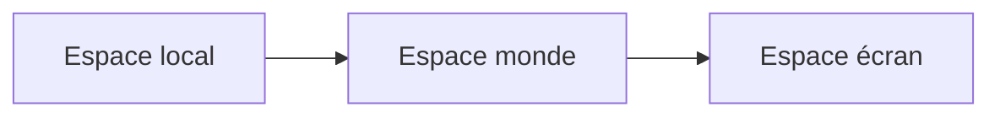

# Holon - Directives pour l'Architecture et le Développement

## Contexte et Expertise

Je suis un architecte d'entreprise avec 25 ans d'expérience dans la conception de systèmes complexes. Mon approche privilégie la rigueur architecturale, la qualité professionnelle et la maintenabilité à long terme.

## Principes Directeurs

### Architecture et Conception

- **Séparation des préoccupations** : Chaque composable (trait) a une responsabilité unique et bien définie
- **Composition plutôt qu'héritage** : Le système de traits permet une composition flexible des comportements
- **Immutabilité et réactivité** : Utiliser les primitives réactives de Vue 3 de manière cohérente
- **Type safety** : TypeScript en mode strict, aucun `any` sauf justification documentée
- **Performance** : Optimisations mesurées, pas de micro-optimisations prématurées

### Standards de Code

- **Nommage explicite** : Les noms de variables et fonctions doivent révéler l'intention
- **Commentaires pertinents** : Expliquer le "pourquoi", pas le "quoi"
- **Tests systématiques** : Chaque trait doit avoir sa suite de tests unitaires

### Fichiers de documentation (`.md`)

Toute documentation, README, ADR, plan, rapport ou note technique au format Markdown doit respecter ces règles **sans exception** :

- **Langue : français** — y compris titres, sous-titres, listes, légendes, tableaux. L'anglais est réservé aux identifiants techniques (noms de fichiers, fonctions, types).
- **Accents corrects** : `é`, `è`, `à`, `ç`, `ù`, `î`, `ô`, etc. Pas de mots accentués écrits sans accent.
- **Diagrammes : Mermaid uniquement**, jamais d'ASCII art. Pour un schéma de flux, séquence, classe, état ou architecture, utiliser un bloc ` ```mermaid `. Si Mermaid ne convient pas (rare), écrire une description textuelle structurée — jamais d'art ASCII.
- **Blocs de code typés** : toujours préciser le langage (` ```ts `, ` ```vue `, ` ```bash `).
- **Ton et style** : phrases complètes, ponctuation française (espaces insécables avant `:` `;` `?` `!` quand possible), pas d'emoji décoratif sauf demande explicite.

Exemple correct :



Exemple à proscrire :

```
<!-- Schéma ASCII converti en description : Local → World → Screen -->
```

### Gestion de la Complexité Géométrique

Le défi majeur de ce projet est la gestion des systèmes de coordonnées multiples :

1. **Local Space** : Coordonnées relatives au parent direct
2. **World Space** : Coordonnées absolues sur le canevas
3. **Screen Space** : Coordonnées pixels de l'écran utilisateur

Le composable `useGeometry` centralise cette logique critique. Toute modification doit préserver la cohérence des transformations.

---

## Plan de Finalisation Professionnelle

### Phase 1 : Consolidation des Fondations (Priorité Critique)

#### 1.1 Audit et Refactoring de Qualité

**Objectif** : Garantir une base de code robuste et maintenable

- [ ] **Revue de code complète** de tous les traits existants
  - Vérifier la cohérence des patterns entre traits
  - Éliminer toute duplication de code
  - Standardiser la gestion d'erreurs
  - Documenter les décisions architecturales complexes

- [ ] **Renforcement du typage TypeScript**
  - Éliminer tous les `any` non justifiés
  - Ajouter des types génériques où approprié
  - Créer des types utilitaires pour les patterns récurrents
  - Documenter les types complexes avec JSDoc

- [ ] **Optimisation de la performance**
  - Profiler les opérations critiques (rendu, calculs géométriques)
  - Implémenter le memoization où nécessaire
  - Optimiser les recalculs de positions absolues
  - Lazy loading des nœuds hors viewport

#### 1.2 Tests et Couverture

**Objectif** : Atteindre 90%+ de couverture avec des tests significatifs

- [ ] **Compléter les tests unitaires**
  - Couvrir tous les cas limites (edge cases)
  - Tests de régression pour les bugs corrigés
  - Tests de performance pour les opérations critiques

- [ ] **Tests d'intégration**
  - Scénarios complets utilisateur (création, modification, suppression)
  - Tests des transformations de coordonnées complexes
  - Tests de persistance IndexedDB

- [ ] **Tests de composants Vue**
  - Tests de rendu avec @vue/test-utils
  - Tests des interactions utilisateur
  - Tests des émissions d'événements

#### 1.3 Documentation Technique

**Objectif** : Documentation exhaustive pour maintenance et évolution

- [ ] **Documentation d'architecture** (ADR - Architecture Decision Records)
  - Pourquoi le state aplati (flattened state)
  - Choix du système de coordonnées
  - Stratégie de persistance locale
  - Pattern des traits/composables

- [ ] **Documentation API complète**
  - JSDoc pour tous les composables publics
  - Exemples d'utilisation pour chaque trait
  - Guide de création de nouveaux traits

- [ ] **Diagrammes d'architecture**
  - Schéma de flux de données (utiliser Mermaid, pas ASCII)
  - Diagramme de dépendances entre composables
  - Séquence des transformations de coordonnées

---

### Phase 2 : Traits Manquants - Niveau Production (Priorité Haute)

#### 2.1 Navigation et Visualisation Avancée

**useViewable** - Système de vues sauvegardées

```typescript
interface View {
  id: string
  name: string
  description?: string
  zoom: number
  panX: number
  panY: number
  filters: FilterConfig[]
  visibleLayers: string[]
  timestamp: number
}
```

**Fonctionnalités** :

- Sauvegarde/restauration de vues
- Vues par stakeholder (Business, Application, Technology)
- Mode présentation (slideshow de vues)
- Transitions animées entre vues
- Export de vue spécifique (PNG, PDF)

**useSearchable** - Recherche globale performante

- Recherche textuelle sur labels, propriétés, métadonnées
- Recherche par expression régulière
- Navigation clavier entre résultats
- Mise en évidence visuelle des résultats
- Historique de recherches

#### 2.2 Export et Interopérabilité

**useExportable** - Export professionnel multi-format

**Formats supportés** :

- **PNG/JPEG** : Rendu haute résolution (300 DPI pour impression)
- **SVG** : Export vectoriel optimisé et autonome
- **PDF** : Multi-pages avec table des matières
- **JSON** : Format propriétaire versionné
- **Archimate Exchange** : Standard Open Group

**Fonctionnalités** :

- Configuration d'export (résolution, format papier)
- Export de vue ou diagramme complet
- Watermark personnalisable
- Métadonnées embarquées (auteur, date, version)

**useImportable** - Import robuste avec validation

- Import JSON avec migration de version
- Import SVG avec parsing intelligent
- Import Archimate Open Exchange (XML)
- Import Markdown avec templates
- Détection et résolution de conflits d'ID
- Preview avant import

#### 2.3 Données et Métadonnées Riches

**usePropertyable** - Système de propriétés extensible

```typescript
interface PropertySchema {
  key: string
  label: string
  type: 'string' | 'number' | 'boolean' | 'date' | 'enum' | 'computed'
  required?: boolean
  defaultValue?: any
  validation?: (value: any) => boolean
  enumValues?: string[]
  computeFn?: (node: Node) => any
}
```

**Fonctionnalités** :

- Propriétés personnalisées par type de nœud
- Propriétés calculées (ex: nombre d'enfants, profondeur)
- Héritage de propriétés (parent → enfant)
- Validation avec messages d'erreur clairs
- Indexation pour recherche rapide

**useTaggable** - Système de tags flexible

- Tags multiples par nœud/edge
- Catégories de tags avec couleurs
- Auto-complétion de tags
- Filtrage et groupement par tags
- Statistiques d'utilisation des tags

**useVersionable** - Gestion de versions professionnelle

- Branches/variantes du diagramme
- Comparaison visuelle (diff) entre versions
- Fusion de branches avec résolution de conflits
- Historique avec annotations
- Tags de version (v1.0, v2.0-draft)

#### 2.4 Validation et Qualité

**useValidatable** - Validation Archimate complète

```typescript
interface ValidationRule {
  id: string
  severity: 'error' | 'warning' | 'info'
  category: 'archimate' | 'structure' | 'style' | 'custom'
  check: (node: Node, context: GraphContext) => ValidationResult
  message: string
  autoFix?: (node: Node) => void
}
```

**Règles de validation** :

- Conformité aux règles Archimate
- Relations valides entre types de nœuds
- Détection de cycles dans les relations
- Nœuds orphelins ou isolés
- Cohérence des styles par layer
- Limites de profondeur d'imbrication
- Suggestions d'amélioration

**useConstrainable** - Contraintes de conception

- Taille min/max par type
- Ratio de forme fixe/libre
- Contraintes de position (grid, bounds)
- Contraintes de relations (cardinalité)
- Validation en temps réel

#### 2.5 Intelligence et Automatisation

**useLayoutable** - Algorithmes de mise en page automatique

- **Hierarchical Layout** : Pour les arbres de processus
- **Force-Directed Layout** : Pour les réseaux de dépendances
- **Grid Layout** : Pour les vues organisées
- **Layered Layout** : Pour les 7 layers Archimate
- **Radial Layout** : Pour les relations centrées
- Configuration fine par algorithme
- Animation des transitions
- Préservation des contraintes utilisateur

**useSuggestable** - Assistants intelligents

- Suggestions de connexions (ex: Function → Process)
- Auto-complétion de types basée sur le contexte
- Détection de patterns communs
- Suggestions de refactoring
- Alertes de bonnes pratiques

---

### Phase 3 : Expérience Utilisateur Professionnelle (Priorité Haute)

#### 3.1 Interface Utilisateur Raffinée

**Toolbar Contextuelle**

- Barre d'outils adaptative selon la sélection
- Actions rapides (dupliquer, supprimer, aligner)
- Raccourcis clavier visibles
- Mode compact/étendu

**Panels Latéraux**

- **Properties Panel** : Édition détaillée des propriétés
- **Layers Panel** : Gestion des calques
- **Outline Panel** : Vue arborescente de la hiérarchie
- **History Panel** : Visualisation de l'historique undo/redo
- Panneaux redimensionnables et détachables

**Mini-map**

- Vue d'ensemble du diagramme
- Indication de la zone visible
- Navigation par clic
- Indication des éléments sélectionnés

**Breadcrumb Navigation**

- Navigation dans la hiérarchie des containers
- Drill-down/drill-up rapide
- Chemin complet du nœud sélectionné

#### 3.2 Interactions Avancées

**useZoomable** - Zoom intelligent

- Zoom sur sélection (fit to selection)
- Zoom sur nœud avec focus
- Zoom avec molette + Ctrl (standard)
- Niveaux de zoom prédéfinis (25%, 50%, 100%, 200%)
- Zoom to fit automatique
- Drill-down : entrer dans un container en plein écran

**usePannable** - Navigation fluide

- Pan avec molette (déjà implémenté, à extraire)
- Pan avec clic molette ou espace + clic
- Limites intelligentes (auto-extend)
- Momentum scrolling optionnel

**useFocusable** - Navigation clavier accessible

- Tab : navigation entre nœuds
- Flèches : navigation spatiale
- Enter : édition du label
- Escape : annuler/désélectionner
- Skip-links pour accessibilité (WCAG AA)

#### 3.3 Thèmes et Apparence

**Extension de useThemeable**

- Thèmes personnalisables complets
- Variables CSS pour tous les éléments
- Mode sombre/clair avec transition
- Palettes Archimate officielles
- Import/export de thèmes
- Thèmes par organisation (branding)

**useIconable** - Bibliothèque d'icônes

- Icônes intégrées dans les nœuds
- Bibliothèque d'icônes Archimate
- Support d'icônes personnalisées (SVG)
- Position configurable (top-left, center, etc.)
- Taille adaptative au zoom

**useBorderable** - Styles de bordure avancés

- Styles multiples (solid, dashed, dotted, double)
- Épaisseur et couleur personnalisables
- Ombres portées (drop-shadow)
- Bordures arrondies (border-radius)

**useGradientable** - Dégradés sophistiqués

- Dégradés linéaires et radiaux
- Presets par layer Archimate
- Éditeur visuel de dégradés
- Export de palettes de dégradés

#### 3.4 Accessibilité (WCAG 2.1 AA)

- [ ] Contraste de couleurs vérifié (ratio 4.5:1 minimum)
- [ ] Navigation clavier complète
- [ ] Lecteurs d'écran (ARIA labels)
- [ ] Focus visuel distinct
- [ ] Alternatives textuelles pour les éléments visuels
- [ ] Pas de dépendance uniquement à la couleur
- [ ] Zones de clic suffisantes (44×44px minimum)

---

### Phase 4 : Fonctionnalités Collaboratives et Entreprise (Priorité Moyenne)

#### 4.1 Persistance et Synchronisation

**Extension de la persistance IndexedDB**

- Compression des données (LZ-String)
- Purge automatique des anciennes versions
- Export automatique de sauvegarde
- Récupération après crash

**useBackupable** - Sauvegardes automatiques

- Backups automatiques configurables (intervalle)
- Historique des backups (rétention configurable)
- Restauration sélective
- Export vers cloud optionnel

**useSyncable** - Synchronisation (optionnel, selon besoins)

- Sync offline-first
- Résolution de conflits automatique/manuelle
- WebSocket pour collaboration temps réel
- Cursors collaboratifs
- Commenting/annotations partagées

#### 4.2 Gestion de Projet

**useModelingConfidence** - Extension

- Niveaux de maturité (draft, review, validated, published)
- Sources de données documentées
- Questions ouvertes par élément
- Workflow d'approbation
- Signatures électroniques

**Audit Trail**

- Journal complet des modifications
- Attribution des changements (qui, quand, quoi)
- Export du journal (CSV, JSON)
- Conformité aux standards d'entreprise

---

### Phase 5 : Optimisations et Scalabilité (Priorité Moyenne)

#### 5.1 Performance Avancée

**Optimisations de rendu**

- Virtual scrolling pour diagrammes > 1000 nœuds
- Culling des nœuds hors viewport
- Simplification LOD (Level of Detail) au dé-zoom
- Canvas pooling pour réutilisation
- Web Workers pour calculs lourds (layout)

**Optimisations de calculs**

- Cache des positions absolues (invalidation intelligente)
- Spatial indexing (R-tree) pour détection de collision
- Debouncing intelligent des recalculs
- Memoization des calculs géométriques

**Bundle size**

- Code splitting par fonctionnalité
- Tree-shaking vérifié
- Lazy loading des traits optionnels
- Compression des assets

#### 5.2 Internationalisation (i18n)

- [ ] Extraction de toutes les chaînes
- [ ] Support de vue-i18n
- [ ] Traductions : français, anglais (minimum)
- [ ] Format de date/nombre localisé
- [ ] Support RTL (Right-to-Left) si nécessaire

---

### Phase 6 : Déploiement et DevOps (Priorité Haute)

#### 6.1 CI/CD Pipeline

```yaml
# Exemple GitHub Actions
- Linting (ESLint + Prettier)
- Type checking (vue-tsc)
- Tests unitaires (Vitest) avec couverture
- Tests E2E (Playwright/Cypress)
- Build de production
- Analyse de bundle (webpack-bundle-analyzer)
- Déploiement automatique (staging/production)
```

#### 6.2 Monitoring et Analytics

- [ ] Error tracking (Sentry ou équivalent)
- [ ] Performance monitoring (Web Vitals)
- [ ] Usage analytics (respect RGPD)
- [ ] Feature flags pour déploiement progressif

#### 6.3 Documentation Utilisateur

- [ ] Guide de démarrage rapide
- [ ] Tutoriels vidéo
- [ ] Documentation Archimate
- [ ] FAQ et troubleshooting
- [ ] Changelog détaillé

---

## Standards de Livraison

### Critères de Qualité Professionnelle

Avant de considérer le projet comme "terminé", chaque fonctionnalité doit respecter :

1. **Code Review** : Revue par au moins un autre développeur
2. **Tests** : Couverture ≥ 80% avec tests significatifs
3. **Documentation** : JSDoc complet + guide utilisateur
4. **Performance** : Pas de régression mesurable
5. **Accessibilité** : Validation WCAG AA
6. **Compatibilité** : Testé sur Chrome, Firefox, Safari, Edge (versions récentes)

### Definition of Done

Une fonctionnalité est "Done" quand :

- ✅ Code implémenté et testé
- ✅ Tests unitaires et d'intégration passent
- ✅ Documentation à jour
- ✅ Pas de dette technique introduite
- ✅ Revue de code approuvée
- ✅ Déployable en production

---

## Priorisation Recommandée

### Sprint 1 (2 semaines) - Qualité et Robustesse

1. Audit de code complet
2. Renforcement des tests (objectif : 90% couverture)
3. Documentation architecture (ADR)
4. Refactoring identifié

### Sprint 2 (2 semaines) - Export/Import Professionnel

1. useExportable (PNG, SVG, PDF)
2. useImportable (JSON, Archimate)
3. Tests d'intégration export/import
4. Documentation utilisateur

### Sprint 3 (2 semaines) - Navigation et Vues

1. useViewable (vues sauvegardées)
2. useSearchable (recherche globale)
3. useZoomable (drill-down)
4. Mini-map et breadcrumb

### Sprint 4 (2 semaines) - Validation et Qualité

1. useValidatable (règles Archimate)
2. usePropertyable (métadonnées riches)
3. useTaggable (organisation)
4. useConstrainable (contraintes)

### Sprint 5 (2 semaines) - Intelligence

1. useLayoutable (auto-layout)
2. useSuggestable (assistants)
3. Optimisations de performance
4. Tests de scalabilité

### Sprint 6 (1 semaine) - UX/UI Polish

1. Toolbar contextuelle
2. Panels latéraux
3. Thèmes avancés
4. Accessibilité WCAG

### Sprint 7 (1 semaine) - DevOps et Déploiement

1. CI/CD pipeline
2. Monitoring
3. Documentation utilisateur finale
4. Release 1.0

---

## Principes de Maintenance

### Dette Technique

- **Zéro tolérance** pour la dette technique non documentée
- Chaque raccourci doit avoir un TODO avec ticket associé
- Revue mensuelle de la dette technique
- Ratio : 20% du temps pour remboursement de la dette

### Évolutivité

- Architecture ouverte pour nouveaux traits
- APIs stables et versionnées
- Breaking changes seulement en major versions
- Migrations automatiques entre versions

### Sécurité

- Validation stricte des données importées
- Sanitization des entrées utilisateur
- Content Security Policy (CSP)
- Audit de dépendances (npm audit)
- Mises à jour régulières des dépendances

---

## Conclusion

Ce plan de finalisation transforme Holon d'un prototype expérimental en une solution professionnelle de modélisation d'architectures d'entreprise. L'accent est mis sur la qualité, la robustesse, l'expérience utilisateur et la maintenabilité à long terme.

La complexité géométrique déjà maîtrisée constitue une base solide. L'ajout méthodique des fonctionnalités manquantes, couplé à une attention rigoureuse à la qualité, permettra de livrer un outil véritablement professionnel, comparable aux solutions commerciales du marché (Archi, BiZZdesign, Sparx EA), tout en conservant son caractère open-source et sa philosophie "local-first".

**Estimation totale** : 12-14 semaines de développement pour un développeur expérimenté, ou 6-7 semaines pour une équipe de 2-3 développeurs.

**Retour sur investissement** : Un outil de modélisation d'architecture d'entreprise de qualité professionnelle, gratuit et open-source, avec une approche innovante basée sur la théorie des holons.
