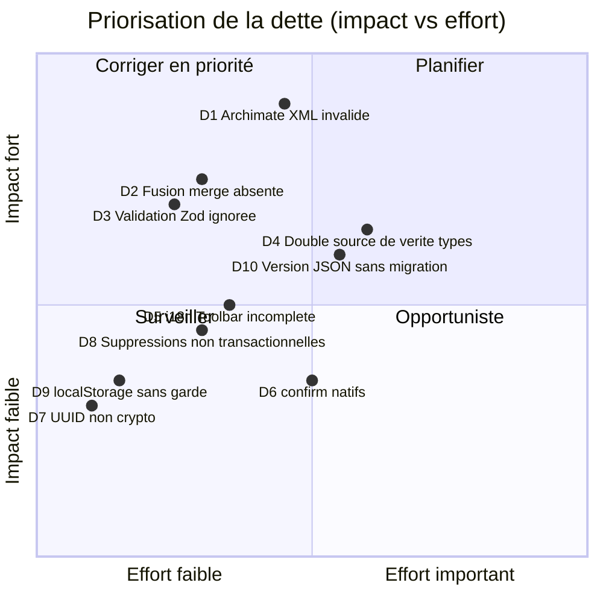
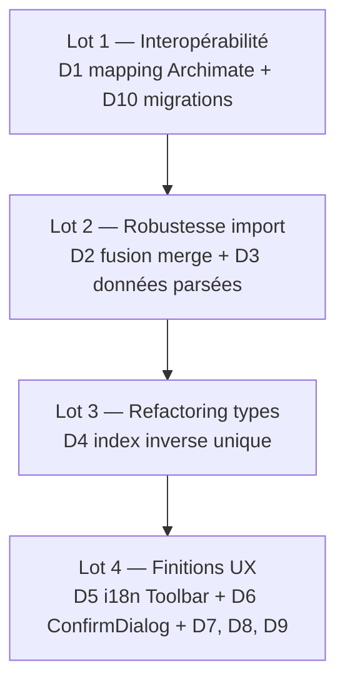

# Dette technique — Audit et plan de remboursement

Ce document recense la dette technique identifiée lors de l'audit du code (juillet 2026). Conformément aux principes de maintenance du projet, chaque élément est décrit, priorisé et associé à une piste de remédiation. Aucun raccourci ne doit rester non documenté : ce fichier fait office de registre.

## Synthèse



| ID | Sujet | Sévérité | Fichiers concernés |
|----|-------|----------|--------------------|
| D1 | Export/import Archimate XML non conforme au standard | **Critique** | `useExportable.ts`, `useImportable.ts` |
| D2 | Stratégie de fusion `merge` documentée mais non implémentée | **Élevée** | `useImportable.ts` |
| D3 | Résultat de la validation Zod jeté (valeurs par défaut non appliquées) | **Élevée** | `useImportable.ts` |
| D4 | Double source de vérité pour les types Archimate | **Élevée** | `useTypeable.ts` |
| D5 | Chaînes françaises en dur dans la Toolbar malgré l'i18n | Moyenne | `Toolbar.vue` |
| D6 | Dialogues `confirm()` natifs pour les actions destructrices | Moyenne | `Toolbar.vue`, `Sidebar.vue`, `ViewsPanel.vue`, `VersionsPanel.vue` |
| D7 | UUID générés via `Math.random()` | Faible | `useExportable.ts` |
| D8 | Suppressions IndexedDB séquentielles hors transaction | Moyenne | `stores/graph.ts` |
| D9 | Accès `localStorage` sans garde d'erreur | Faible | `usePropertyable.ts` |
| D10 | Format JSON versionné `1.0` sans mécanisme de migration | Moyenne | `useExportable.ts`, `useImportable.ts` |

---

## D1 — Export/import Archimate XML non conforme (critique)

**Constat.** `exportAsArchimate` écrit le type interne kebab-case directement dans l'attribut `xsi:type` :

```ts
// useExportable.ts — le type stocké par useTypeable est « business-actor »
const archimateType = node.data?.archimateType || 'BusinessActor'
xml += `    <element xsi:type="archimate:${archimateType}" ...>`
```

Le standard Open Group ArchiMate 3.x attend des noms PascalCase (`BusinessActor`, `ApplicationComponent`). Le fichier produit est donc rejeté par les outils conformes (Archi, BiZZdesign). Symétriquement, `importFromArchimate` retire le préfixe `archimate:` et stocke la valeur telle quelle dans `data.archimateType` : un fichier standard produit des types PascalCase qui ne correspondent à aucune clé de `ARCHIMATE_TYPES`, donc :

- aucune détection de couche (`archimateLayer` retourne `null`) ;
- aucun tint de couleur ni icône dans `NodeRenderer` ;
- les sections par couche de l'export PDF ignorent silencieusement ces nœuds.

L'aller-retour Holon → XML → Holon perd donc la sémantique des types. La valeur de repli `'BusinessActor'` à l'export est elle-même incohérente avec le référentiel interne.

**Remédiation.** Introduire une table de correspondance bidirectionnelle kebab-case ↔ PascalCase dans `useTypeable.ts` (source unique), l'utiliser dans les deux sens, et couvrir l'aller-retour par un test d'intégration.

## D2 — Stratégie de fusion `merge` non implémentée (élevée)

**Constat.** `ImportOptions.mergeStrategy` documente trois valeurs (`append`, `replace`, `merge` « fusionne intelligemment »), mais `importFromJSON` ne traite que `replace` ; `merge` se comporte exactement comme `append` sans avertissement.

```ts
// useImportable.ts — seul « replace » a un effet
if (mergeStrategy === 'replace') {
  await graphStore.clearAll()
}
```

**Remédiation.** Soit implémenter la fusion (rapprochement par ID puis par nom/type), soit retirer la valeur de l'union de types et de la JSDoc. Une API qui accepte silencieusement une option sans effet est un piège pour l'appelant.

## D3 — Résultat de la validation Zod jeté (élevée)

**Constat.** `validateImport` appelle `ImportDataSchema.parse(data)` mais le résultat parsé est ignoré : `importFromJSON` repart des données brutes.

```ts
// Les défauts déclarés dans les schémas ne sont jamais appliqués :
// routing: z.enum([...]).default('straight')
// data: z.record(...).default({})
let { nodes, edges } = data as { nodes: Node[]; edges: Edge[] }
```

Conséquence : une arête importée sans `routing` arrive dans le store avec `routing: undefined`, alors que le schéma promettait `'straight'`. Le cast `as` masque le trou de typage.

**Remédiation.** Faire retourner les données parsées par `validateImport` (ou utiliser `safeParse`) et alimenter le store avec elles. Compléter au passage `EdgeSchema` avec `startArrow`, `endArrow` et `arrowSize`, aujourd'hui absents du schéma.

## D4 — Double source de vérité pour les types Archimate (élevée)

**Constat.** `useTypeable.ts` définit à la fois l'objet `ARCHIMATE_TYPES` (catalogue par couche) et l'enum `ArchimateType` (61 membres) qui dupliquent les mêmes identifiants. Toute évolution exige une double mise à jour, sans garde-fou de compilation entre les deux. S'ajoutent trois parcours linéaires quasi identiques (`archimateLayer`, `typeLabel`, `typeIcon`) qui reconstruisent la même recherche inverse à chaque évaluation.

**Remédiation.** Dériver l'enum (ou un type union) des clés de `ARCHIMATE_TYPES` via `keyof`, et précalculer un index inverse type → (couche, libellé, icône) construit une seule fois au chargement du module (le pattern existe déjà dans `buildTypeToLayerMap` de `useExportable.ts` — à mutualiser).

## D5 — Chaînes françaises en dur dans la Toolbar (moyenne)

**Constat.** Malgré les commits annonçant un « bouclage 100 % » de l'i18n, `Toolbar.vue` affiche encore en dur : `Historique`, `Couches`, `Mise en page…`, `Algorithmes`, `Aligner`, `Gauche`, `Droite`, `Haut`, `Bas`, `Grouper`, `Dégrouper`, `Grille`, `Aimant`, ainsi que les libellés et infobulles du tableau `LAYOUTS`. Un utilisateur en locale anglaise voit une interface mixte.

**Remédiation.** Migrer ces chaînes vers `useI18n` (les clés `toolbar.*` existent déjà pour la plupart : `toolbar.history`, `toolbar.layers`, `toolbar.grid`, `toolbar.snap`…) et ajouter les clés manquantes pour les menus d'alignement et de layout.

## D6 — Dialogues `confirm()` natifs (moyenne)

**Constat.** Cinq actions destructrices (effacement du canevas, suppression de bloc, de vue, de version, restauration) passent par `window.confirm`. Ces dialogues ne respectent ni le thème, ni l'accessibilité annoncée (focus trap, ARIA), et sont bloquants pour les tests E2E.

**Remédiation.** Créer un composant `ConfirmDialog` unique (ou un trait `useConfirmable`) réutilisé partout.

## D7 — UUID via `Math.random()` (faible)

**Constat.** `generateUUID()` dans `useExportable.ts` implémente un UUID v4 à base de `Math.random()`, alors que `crypto.randomUUID()` est disponible dans tous les navigateurs cibles. Risque de collision faible mais non nul, et le projet utilise déjà `nanoid` partout ailleurs.

**Remédiation.** Remplacer par `crypto.randomUUID()` avec repli `nanoid`.

## D8 — Suppressions IndexedDB séquentielles (moyenne)

**Constat.** `deleteNode` dans `stores/graph.ts` émet un `await db.nodes.delete(...)` par nœud et par arête supprimés. La suppression d'un conteneur profond génère N transactions successives, sans atomicité : un crash au milieu laisse un graphe partiellement supprimé en base. Le pattern transactionnel correct existe pourtant dans `batchedUpdateNodes` et `replaceAll`.

**Remédiation.** Regrouper les suppressions dans une transaction `db.transaction('rw', db.nodes, db.edges, …)` avec `bulkDelete`.

## D9 — Accès `localStorage` sans garde (faible)

**Constat.** `usePropertyable.createTemplate` lit et écrit `localStorage` sans `try/catch`, contrairement à la convention appliquée dans `useFilterable`, `useVersionable` et `useEventStormable`. En navigation privée ou quota dépassé, l'exception remonte jusqu'à l'UI.

**Remédiation.** Aligner sur le pattern commun (helper partagé `safeLocalStorage` dans `utils/`).

## D10 — Version JSON sans migration (moyenne)

**Constat.** L'export JSON embarque `version: '1.0'` mais `importFromJSON` ignore complètement ce champ : aucun contrôle de compatibilité, aucun chemin de migration, alors que le plan projet exige « Import JSON avec migration de version ». Le jour où le format évolue, les anciens fichiers casseront sans message clair.

**Remédiation.** Vérifier `version` à l'import, router vers des fonctions de migration `1.0 → 1.1 → …`, et refuser proprement les versions inconnues avec un message localisé.

---

## Plan de remboursement proposé



Chaque lot doit respecter la *Definition of Done* du projet : tests unitaires et d'intégration, documentation à jour, aucune dette nouvelle introduite. Le ratio de 20 % du temps de sprint consacré au remboursement (cf. principes de maintenance) permet d'absorber les lots 1 et 2 sur les deux prochains sprints.
