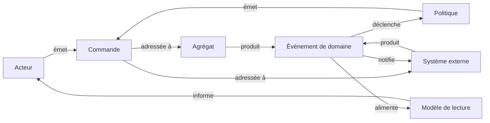

# Mode Event Storming

Holon propose deux notations de canevas : la notation **Archimate** historique et un mode **Event Storming** pour animer des ateliers d'exploration de domaine (méthode d'Alberto Brandolini). Ce document décrit le fonctionnement du mode, son architecture et sa grammaire.

## Utilisation

1. Dans la barre d'outils, la bascule de notation (à gauche du zoom) permet de passer d'« Archimate » à « Event Storming ». Le choix est persisté localement (`localStorage`) et restauré au prochain démarrage.
2. En mode Event Storming, la barre latérale affiche une palette de huit stickers. Chaque sticker se glisse-dépose sur le canevas, comme les blocs de la bibliothèque.
3. Les stickers restent des nœuds Holon ordinaires : déplacement, redimensionnement, édition du libellé, connexions, undo/redo, export et import fonctionnent sans adaptation.

## Palette de stickers

Les couleurs suivent la convention de l'atelier « Big Picture » :

| Sticker | Couleur | Rôle |
|---------|---------|------|
| Événement de domaine | Orange | Fait métier survenu, formulé au passé |
| Commande | Bleu | Intention ou décision qui déclenche un changement |
| Acteur | Jaune | Personne ou rôle qui émet la commande |
| Agrégat | Jaune pâle (conteneur) | Unité de cohérence qui reçoit les commandes et émet les événements |
| Politique | Lilas | Règle de réaction : « quand X, alors Y » |
| Modèle de lecture | Vert | Donnée consultée pour prendre une décision |
| Système externe | Rose | Système tiers hors du domaine |
| Point chaud | Rouge | Question ouverte, conflit ou zone de friction |

L'agrégat est le seul sticker de type conteneur : il grandit automatiquement (`autosize`) pour accueillir commandes et événements imbriqués.

## Grammaire de l'atelier

Le trait fournit un vérificateur de grammaire (`checkGrammar`) qui contrôle le sens des flèches entre stickers typés :

Règles particulières :

- le **point chaud** est une annotation libre : il peut être relié à n'importe quel sticker, dans les deux sens, sans jamais lever de violation ;
- les liens impliquant un nœud non typé (boîte libre, note) sont ignorés par le vérificateur ;
- toute autre combinaison (par exemple une commande reliée directement à une politique) est signalée comme violation, avec l'identifiant de l'arête fautive.

## Architecture

Le mode est porté par le trait `useEventStormable` (`src/composables/traits/useEventStormable.ts`), conforme au pattern des traits applicatifs :

- **Catalogue** : `EVENT_STORMING_TYPES` définit couleur, taille, icône et nature (`shape` ou `container`) de chaque sticker.
- **État global de module** : la notation courante est un `ref` partagé entre la Toolbar (bascule) et la Sidebar (palette), persisté sous la clé `holon-notation-mode`.
- **Fabrique de gabarits** : `createStickerTemplate(type, name?)` retourne un `Omit<Node, 'id' | 'parentId'>` directement instanciable par `graphStore.createNode` ou par le canal drag & drop existant (`dataTransfer` en `application/json`). Le gabarit pose `data.customFill = true` afin que la couleur conventionnelle du sticker ne soit jamais écrasée par un tint de type.
- **Typage des nœuds** : le type de sticker est stocké dans `data.eventStormingType`, indépendamment de `data.archimateType` — un même modèle peut contenir les deux notations sans conflit.
- **Grammaire** : `EVENT_STORMING_GRAMMAR` encode les transitions autorisées ; `checkGrammar()` parcourt les arêtes du store et retourne la liste des violations.

Les tests unitaires du trait couvrent le catalogue, la bascule persistée, la fabrique de gabarits et la grammaire (`src/composables/traits/__tests__/useEventStormable.spec.ts`).
