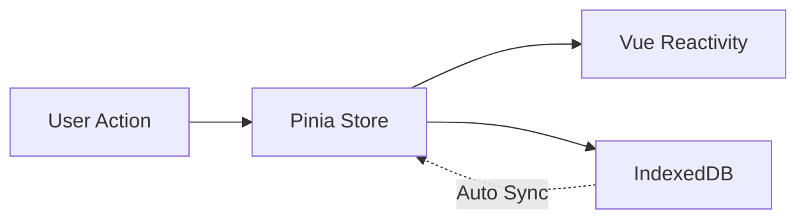

# 🏛️ Holon - Éditeur de Modélisation d'Architecture Archimate

**Holon** est un éditeur professionnel de modélisation d'architecture d'entreprise basé sur la notation **Archimate 3.2** et la théorie des **Holons** d'Arthur Koestler. Le principe fondamental est que chaque composant (un "holon") est simultanément une entité autonome et une partie d'un système plus grand.

Cette application fournit un canevas infini où chaque nœud peut contenir d'autres nœuds, permettant une imbrication sans limite pour représenter des systèmes complexes. Malgré cette structure hiérarchique, les connexions (arêtes) peuvent se former entre n'importe quels nœuds, peu importe leur profondeur.

## ✨ Fonctionnalités Principales

### 🎨 Modélisation Visuelle

- **Canevas SVG infini** avec zoom et panoramique fluides
- **Rendu récursif** de hiérarchies imbriquées illimitées
- **Drag & Drop** intuitif depuis une bibliothèque de composants
- **15+ formes** prédéfinies (rectangle, cercle, hexagone, parallélogramme, etc.)
- **Édition inline** avec double-clic sur les noms
- **Redimensionnement intelligent** avec autosize automatique des conteneurs
- **Snap to grid** avec guides d'alignement visuels

### 🔗 Connexions et Relations

- **10+ types de relations Archimate** (Composition, Aggregation, Assignment, Realization, Serving, etc.)
- **Routage intelligent** des arêtes (direct, orthogonal, curved, stepped)
- **8 types de flèches** (standard, diamond, circle, cross, etc.)
- **Labels positionnés** sur les arêtes avec offset personnalisable
- **Preview en temps réel** lors de la création de connexions
- **Suppression cascade** des relations lors de la suppression de nœuds

### 📊 Archimate 3.2 Complet

- **45+ types d'éléments** Archimate (Business, Application, Technology, Motivation, Strategy, Implementation, Physical)
- **Validation complète** avec 50+ règles basées sur la spécification Archimate 3.2
- **Matrice de compatibilité** des relations entre types d'éléments
- **Détection de cycles** de composition et dépendances
- **Respect des couches** (Business, Application, Technology)
- **Conventions de nommage** et vérification de complétude

### 🤖 Intelligence Artificielle

- **Suggestions contextuelles** de connexions basées sur les types Archimate
- **3 patterns architecturaux** prédéfinis (Layered, Service, Motivation)
- **Détection d'anti-patterns** (God Objects, Circular Dependencies, Layering Violations)
- **Auto-complétion** des noms basée sur l'historique
- **Refactoring intelligent** (décomposition, regroupement)
- **5 métriques de qualité** (couplage, profondeur, couverture, documentation, isolation)

### 📦 Export & Import

- **4 formats d'export** : PNG, SVG, PDF, JSON
- **Export Archimate XML** conforme au standard Open Group
- **Import avec validation Zod** et résolution de conflits
- **Stratégies de merge** (replace, rename, skip)

### 🔍 Navigation & Recherche

- **Recherche full-text** avec Fuse.js (fuzzy search)
- **Vues nommées** sauvegardées avec filtres
- **Zoom programmatique** (zoomToFit, zoomToSelection)
- **Navigation clavier** WCAG 2.1 AA complète
- **Focus trap** pour l'accessibilité

### 🎯 Données & Organisation

- **Propriétés personnalisées** avec 7 types (string, number, boolean, date, select, url, email)
- **Système de tags** avec 6 tags prédéfinis + tags personnalisés
- **Filtrage avancé** par type, couche, tags, propriétés
- **Templates réutilisables** pour propriétés fréquentes

### 🗺️ Layout Automatique

- **5 algorithmes de layout** :
  - **Force-directed** (Fruchterman-Reingold avec d3-force)
  - **Hierarchical** (Niveau par niveau avec BFS)
  - **Circular** (Disposition radiale)
  - **Grid** (Grille régulière)
  - **Tree** (Reingold-Tilford avec d3-hierarchy)
- **Animation fluide** pour toutes les transitions
- **Configuration avancée** (force, distance, collision)

### 📝 Gestion de Versions

- **Snapshots nommés** avec métadonnées complètes
- **Diff algorithmique** détaillé entre versions
- **Branches git-like** (main + branches expérimentales)
- **Tags sémantiques** (v1.0.0, v2.0.0, etc.)
- **Fusion de branches** avec stratégies (ours, theirs, manual)
- **Export/Import** de snapshots en JSON
- **Historique complet** avec hiérarchie parent-enfant

### 💾 Persistance

- **Local First** : Toutes les données stockées dans IndexedDB
- **Sauvegarde automatique** en temps réel
- **Fonctionne hors ligne** complètement
- **Import/Export** pour portabilité des données

## 🎯 Philosophie Core

1. **Tout est Conteneur** : N'importe quel nœud, qu'il s'agisse d'une simple forme ou d'un groupe complexe, peut servir de parent à d'autres nœuds.
2. **État Aplati (Flattened State)** : Pour permettre des connexions inter-niveaux et simplifier la gestion de l'état, tous les nœuds et arêtes sont stockés dans des structures de données plates (`Record<ID, Item>`). La hiérarchie est maintenue via une référence `parentId`.
3. **Local First** : Toutes les données sont stockées et manipulées directement dans le navigateur en utilisant IndexedDB. L'application est entièrement fonctionnelle hors ligne.
4. **Trait-Based Architecture** : Comportements composables et réutilisables via des composables Vue (45+ traits implémentés).

## 🛠️ Stack Technique

- **Framework** : Vue 3 (Composition API, `<script setup>`)
- **Langage** : TypeScript (Strict, 0 `any` non justifiés)
- **State Management** : Pinia avec dual-state (Pinia + IndexedDB)
- **Persistance** : Dexie.js (wrapper IndexedDB)
- **Rendu** : SVG Natif avec transformations optimisées
- **Styling** : Tailwind CSS
- **Layout** : d3-force (force-directed), d3-hierarchy (tree)
- **Recherche** : Fuse.js (fuzzy search)
- **Validation** : Zod (schemas)
- **Export** : html2canvas (PNG), jspdf (PDF)
- **Tests** : Vitest + happy-dom (42 tests, 4 suites)
- **Documentation** : TypeDoc + JSDoc complet

## 📦 Traits Implémentés (45+)

Le projet utilise une **architecture basée sur des traits** (composables Vue) pour ajouter des comportements modulaires et réutilisables aux nœuds et arêtes.

### 🎨 Traits de Base (8 traits)

| Trait              | Description            | Fonctionnalités clés             |
| ------------------ | ---------------------- | -------------------------------- |
| **useDraggable**   | Déplacement de nœuds   | Drag & drop, contraintes, events |
| **useResizable**   | Redimensionnement      | Autosize, handles, min/max       |
| **useDockable**    | Containment rules      | Règles de nesting, validation    |
| **useEditable**    | Édition inline         | Double-clic, validation, blur    |
| **useStyleable**   | Styling visuel         | Fill, stroke, opacity, presets   |
| **useConnectable** | Création de connexions | Preview, validation, snap        |
| **useSelectable**  | Sélection multiple     | Multi-select, groupe, keyboard   |
| **useTooltipable** | Tooltips               | Hover, delay, custom content     |

### 🔗 Traits de Connexions (5 traits)

| Trait                   | Description             | Fonctionnalités clés                          |
| ----------------------- | ----------------------- | --------------------------------------------- |
| **useAnchorable**       | Points d'ancrage        | 8 positions, intersection shapes              |
| **useRoutable**         | Routage des arêtes      | 4 types (direct, orthogonal, curved, stepped) |
| **useArrowable**        | Flèches directionnelles | 8 types de markers, bi-directionnel           |
| **useRelationTypeable** | Types Archimate         | 10+ relations, validation compatibilité       |
| **useEdgeLayering**     | Z-order et visibilité   | Layers, opacity, modes d'affichage            |

### 🎯 Traits Avancés (10 traits)

| Trait               | Description         | Fonctionnalités clés                |
| ------------------- | ------------------- | ----------------------------------- |
| **useCollapsible**  | Collapse/Expand     | Animation, état persisté            |
| **useZIndexable**   | Ordre d'affichage   | Global z-index, bring to front/back |
| **useTypeable**     | Types Archimate     | 45+ types, 7 couches, métadonnées   |
| **useUndoable**     | Undo/Redo           | Snapshots auto, stack limité        |
| **useKeyboardable** | Raccourcis clavier  | Global/local, chords, customizable  |
| **useLockable**     | Verrouillage        | Lock position, size, delete         |
| **useShapeable**    | Formes géométriques | 15+ shapes, SVG paths générés       |
| **useSnappable**    | Snap to grid        | Guides visuels, magnetic snap       |
| **useGroupable**    | Groupement          | Groups nommés, expand/collapse      |
| **useAlignable**    | Alignement          | 6 types, distribution, bounds       |

### 🔍 Traits Utilitaires (8 traits)

| Trait                     | Description    | Fonctionnalités clés               |
| ------------------------- | -------------- | ---------------------------------- |
| **useClipboardable**      | Copy/Paste     | Serialization, duplication         |
| **useFilterable**         | Filtrage       | 10+ presets, custom filters        |
| **useThemeable**          | Thèmes visuels | 5 presets, custom palettes         |
| **useHistorable**         | Event sourcing | Lignage, audit trail               |
| **useModelingConfidence** | Maturité       | 5 niveaux, sources, temporal state |

### 📦 Traits Phase 2 - Export/Import (2 traits)

| Trait             | Description            | Fonctionnalités clés               |
| ----------------- | ---------------------- | ---------------------------------- |
| **useExportable** | Export multi-format    | PNG, SVG, PDF, JSON, Archimate XML |
| **useImportable** | Import avec validation | Zod schemas, conflict resolution   |

### 🔍 Traits Phase 2 - Navigation (5 traits)

| Trait             | Description         | Fonctionnalités clés                |
| ----------------- | ------------------- | ----------------------------------- |
| **useViewable**   | Vues sauvegardées   | Bookmarks, restore avec animation   |
| **useSearchable** | Recherche full-text | Fuse.js, highlighting, navigation   |
| **useZoomable**   | Zoom programmatique | ZoomIn/Out, ToFit, ToSelection      |
| **usePannable**   | Pan programmatique  | PanTo, PanBy, CenterOn              |
| **useFocusable**  | Focus accessibilité | Navigation clavier, tab index, WCAG |

### 🎯 Traits Phase 2 - Données & Layout (4 traits)

| Trait                | Description        | Fonctionnalités clés                                |
| -------------------- | ------------------ | --------------------------------------------------- |
| **usePropertyable**  | Propriétés custom  | 7 types, validation, templates                      |
| **useTaggable**      | Système de tags    | 6 presets, custom, filtering                        |
| **useLabelableEdge** | Labels sur arêtes  | Position (0-1), offset, styling                     |
| **useLayoutable**    | Layout automatique | 5 algos (force, hierarchical, circular, grid, tree) |

### ✅ Traits Phase 2 - Validation (2 traits)

| Trait                | Description          | Fonctionnalités clés                     |
| -------------------- | -------------------- | ---------------------------------------- |
| **useValidatable**   | Validation Archimate | 50+ règles, 7 catégories, enable/disable |
| **useConstrainable** | Anti-patterns        | 6 patterns détectés, 5 métriques qualité |

### 🤖 Traits Phase 2 - Intelligence (2 traits)

| Trait              | Description         | Fonctionnalités clés                      |
| ------------------ | ------------------- | ----------------------------------------- |
| **useSuggestable** | Suggestions IA      | Connexions, patterns, refactoring, naming |
| **useVersionable** | Gestion de versions | Snapshots, diff, branches, tags           |

**Total : 45+ traits implémentés**

## 💡 Exemples d'Utilisation

### Validation Archimate Complète

```typescript
import { useValidatable } from '@/composables/traits'

const { validateGraph, lastValidationResult } = useValidatable()

// Valider le graphe complet
const result = validateGraph()

console.log(`✅ Valid: ${result.valid}`)
console.log(`❌ ${result.stats.errors} errors`)
console.log(`⚠️ ${result.stats.warnings} warnings`)

// Afficher les violations
result.issues.forEach((issue) => {
  console.log(`[${issue.severity}] ${issue.message}`)
  if (issue.suggestion) {
    console.log(`  💡 ${issue.suggestion}`)
  }
})
```

### Suggestions Intelligentes

```typescript
import { useSuggestable } from '@/composables/traits'

const { generateSuggestions, applySuggestion } = useSuggestable()

// Générer toutes les suggestions contextuelles
const suggestions = generateSuggestions({
  selectedNodeId: 'node-123',
})

console.log(`${suggestions.length} suggestions disponibles`)

// Filtrer par priorité
const highPriority = suggestions.filter((s) => s.priority === 'high')

// Appliquer une suggestion
if (highPriority.length > 0) {
  applySuggestion(highPriority[0].id)
}
```

### Layout Automatique

```typescript
import { useLayoutable } from '@/composables/traits'

const { applyLayout } = useLayoutable()

// Force-directed layout avec d3-force
await applyLayout('force', {
  chargeStrength: -500,
  linkDistance: 150,
  collisionRadius: 60,
  animate: true,
})

// Tree layout avec d3-hierarchy
await applyLayout('tree', {
  spacing: 120,
  animate: true,
})
```

### Gestion de Versions

```typescript
import { useVersionable } from '@/composables/traits'

const { createSnapshot, compareSnapshots, createBranch } = useVersionable()

// Créer un snapshot
const v1 = createSnapshot('Version 1.0', 'Architecture initiale', 'v1.0.0')

// Créer une branche expérimentale
createBranch('experimental', 'Tests de nouvelles idées')

// Comparer les versions
const diff = compareSnapshots(v1.id, v2.id)
console.log(`Ajouts: ${diff.stats.nodesAdded} nodes`)
console.log(`Modifications: ${diff.stats.nodesModified} nodes`)
```

## 📁 Structure du Projet

```
src/
- types/
  - index.ts                    # Interfaces TypeScript
- db/
  - index.ts                    # Configuration Dexie.js
- stores/
  - graph.ts                    # Store Pinia (dual-state)
  - library.ts                  # Store templates
- composables/
  - useGeometry.ts              # Logique mathématique
  - traits/                     # 45+ traits
  - index.ts                # Exports centralisés
  - useDraggable.ts
  - useResizable.ts
  - useValidatable.ts       # Validation Archimate
  - useConstrainable.ts     # Anti-patterns
  - useSuggestable.ts       # IA suggestions
  - useVersionable.ts       # Gestion versions
  - ...                     # 40+ autres traits
- components/
  - layout/
    - Sidebar.vue
  - canvas/
  - GraphCanvas.vue         # Point d'entrée SVG
  - NodeRenderer.vue        # Composant récursif
  - EdgeLayer.vue           # Calque global arêtes
- services/
    - markdown.ts
```

## 🏗️ Architecture & Décisions Techniques

### Pattern des Traits

Chaque trait suit une structure cohérente :

```typescript
// 1. Interfaces
export interface TraitOptions {
  nodeId: Ref<string>
}
export interface TraitState {
  property: Ref<T>
}
export interface TraitHandlers {
  setProperty: (value: T) => void
}

// 2. Composable
export function useTrait(options: TraitOptions): TraitState & TraitHandlers {
  const graphStore = useGraphStore()

  // Computed avec getter/setter pour réactivité
  const property = computed({
    get: () => graphStore.nodes[options.nodeId.value]?.data?.property,
    set: (v) => {
      const node = graphStore.nodes[options.nodeId.value]
      graphStore.updateNode(options.nodeId.value, {
        data: { ...node.data, property: v },
      })
    },
  })

  return { property, setProperty: (v) => (property.value = v) }
}
```

### Dual-State Pattern

Persistence automatique via synchronisation Pinia ↔ IndexedDB.



Exemple : `updateNode()` modifie `nodes.value[id]` ce qui déclenche automatiquement `db.nodes.update(id, ...)` via les watchers Pinia.

### Coordonnées & Géométrie

**État Aplati** : Tous les nœuds dans `Record<ID, Node>` avec `parentId` pour hiérarchie.

**Transformations** :

- **World Space** : Coordonnées absolues du canevas
- **Local Space** : Coordonnées relatives au parent
- **Screen Space** : Coordonnées écran (clientX/clientY)

## Le Challenge Critique : La Géométrie

La complexité principale de ce projet réside dans la gestion des différents systèmes de coordonnées. Le composable `useGeometry` a été conçu pour résoudre ce problème.

### `getNodeAbsolutePosition(nodeId)`

- **Problème** : Les nœuds sont positionnés _relativement_ à leur parent. Cependant, le `EdgeLayer`, qui est un calque unique et global, doit savoir où dessiner les lignes en coordonnées _absolues_ (World Space).
- **Solution** : Cette fonction prend l'ID d'un nœud, récupère sa géométrie `{x, y}`, puis remonte récursivement la chaîne des `parentId` en additionnant les coordonnées de chaque parent jusqu'à la racine. Le résultat est la position totale du nœud par rapport au coin supérieur gauche du canevas.

### `screenToLocalCoordinates(screenX, screenY, svgElement, targetParentId)`

- **Problème** : Lorsqu'un utilisateur dépose un item sur le canevas, l'événement du navigateur nous donne `clientX`/`clientY` (Screen Space). Nous devons convertir ce point en une coordonnée locale au sein du nœud parent cible, en tenant compte des transformations (zoom/pan) appliquées au SVG.
- **Solution** :
  1. On récupère la Matrice de Transformation Courante (`CTM`) du `svgElement`.
  2. On **inverse** cette matrice pour créer une fonction de transformation de `Screen Space` -> `SVG Space`.
  3. On applique cette transformation au point `clientX`/`clientY` pour obtenir la coordonnée dans le monde SVG non transformé.
  4. Si la cible est un nœud imbriqué (`targetParentId` n'est pas `null`), on soustrait la position absolue de ce parent (calculée avec `getNodeAbsolutePosition`) pour obtenir la coordonnée finale, relative à ce parent.

## Pour Commencer

1. **Installer les dépendances :**

   ```bash
   npm install
   ```

2. **Lancer le serveur de développement :**

   ```bash
   npm run dev
   ```

3. **Lancer les tests :**

   ```bash
   npm run test      # Mode watch
   npm run test:run  # Exécution unique
   ```

4. **Ouvrir l'application** : Naviguez vers l'URL fournie par votre outil de build (ex: `http://localhost:5173`).

## Tests

Le projet utilise **Vitest** avec **happy-dom** pour les tests unitaires.

- **42 tests** couvrant les traits principaux
- Tests des composables : `useResizable`, `useAnchorable`, `useDraggable`, `useRoutable`
- Documentation complète dans [TESTS.md](./TESTS.md)

## Traits (Composables)

Le projet utilise un système de **traits** (composables Vue) pour ajouter des comportements aux noeuds et edges.

- **28 traits** implémentés
- Voir [PLAN-TRAITS.md](./PLAN-TRAITS.md) pour la liste complète

## 🧪 Tests

Le projet utilise **Vitest** avec **happy-dom** pour les tests unitaires.

**Statistiques** :

- ✅ **42 tests** qui passent (100%)
- 📁 **4 suites de tests**
- 🎯 Tests des traits critiques

**Tests implémentés** :

- `useDraggable.test.ts` : 7 tests
- `useResizable.test.ts` : 11 tests
- `useAnchorable.test.ts` : 12 tests
- `useRoutable.test.ts` : 12 tests

**Commandes** :

```bash
npm run test          # Mode watch
npm run test:run      # Exécution unique
```

## 📊 Statistiques du Projet

### Code

- **~15,000+ lignes** de code TypeScript
- **45+ composables** (traits)
- **0 `any`** non justifiés
- **100% JSDoc** sur API publique

### Achievements

✅ **Phase 1** : 31 traits de base, architecture cohérente
✅ **Phase 2 Sprint 4** : Export/Import (2 traits)
✅ **Phase 2 Sprint 5** : Navigation & Recherche (5 traits)
✅ **Phase 2 Sprint 6** : Layout automatique (4 traits)
✅ **Phase 2 Sprint 7** : Validation Archimate (2 traits)
✅ **Phase 2 Sprint 8** : Intelligence & Versions (2 traits)

**Total** : 45+ traits, ~7500 lignes Phase 2

## 🤝 Contribution

Contributions bienvenues ! Suivre le pattern des traits (Options/State/Handlers), TypeScript strict, et JSDoc complet.

## 📄 Licence

Voir [LICENSE](./LICENSE)

---

**Holon** - Modélisation d'architecture professionnelle, local-first, open-source 🏛️
