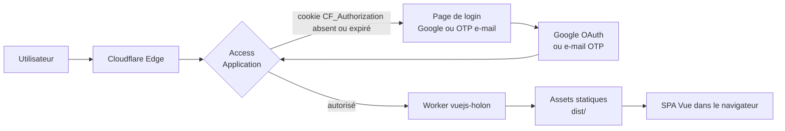

# Déploiement et protection d'accès

Ce document décrit le déploiement de Holon sur Cloudflare Workers et la mise en place de l'authentification par Google ou code à usage unique (OTP) par e-mail via **Cloudflare Zero Trust Access**.

## Architecture cible



Cloudflare Access intercepte chaque requête avant qu'elle n'atteigne le Worker. Le navigateur reçoit un cookie signé `CF_Authorization` à durée de vie configurable ; les requêtes suivantes ne refont pas tout le tour OAuth.

## Pile de déploiement

| Couche | Rôle | Fichier ou ressource |
| --- | --- | --- |
| Bundling | Compile la SPA Vue en bundle statique | `vite build` → `./dist/` |
| Workers | Sert les assets statiques (pas de logique serveur) | `wrangler.jsonc` |
| Zero Trust Access | Authentifie l'utilisateur avant le Worker | Dashboard Cloudflare |
| Identity Providers | Authentifient l'utilisateur | Google OAuth + OTP e-mail |

### Configuration du Worker

Le fichier `wrangler.jsonc` à la racine déclare le déploiement comme une application uniquement statique :

```jsonc
{
  "$schema": "node_modules/wrangler/config-schema.json",
  "name": "vuejs-holon",
  "compatibility_date": "2026-06-12",
  "assets": {
    "directory": "./dist",
    // SPA : toute requête sans fichier statique correspondant est rejouée
    // vers index.html pour laisser le routeur côté client gérer l'URL.
    "not_found_handling": "single-page-application"
  }
}
```

Pas de point d'entrée Worker (`main`) : Cloudflare déploie directement le bundle Vite produit par `npm run build`.

## Pipeline de déploiement Cloudflare

Le service Cloudflare exécute, dans l'ordre :

1. `npm clean-install --progress=false` (utilise `package-lock.json`).
2. `npm run build` (exécute `vue-tsc && vite build`).
3. `npx wrangler versions upload` (lit `wrangler.jsonc`, publie `./dist`).

Si le build échoue, vérifier successivement :

- Le lockfile est-il à jour ? (`npm ci` localement doit passer sans `--legacy-peer-deps`).
- La version de Node correspond-elle à celle attendue (Node 20+) ?
- `npm run typecheck` et `npm run lint` passent-ils localement ?

## Mise en place de la protection d'accès (Zero Trust)

Toute la configuration se fait dans le tableau de bord Cloudflare, sans modification du code.

### Étape 1 — Activer Zero Trust

1. Aller sur `dash.cloudflare.com`.
2. Sélectionner **Zero Trust** dans la barre latérale.
3. Si c'est la première fois : choisir un nom d'équipe. Le plan **Free** suffit (jusqu'à 50 utilisateurs).

### Étape 2 — Ajouter Google comme fournisseur d'identité

1. **Côté Google Cloud** : créer un OAuth Client.
   - Console Google Cloud → APIs & Services → Credentials → Create Credentials → OAuth client ID.
   - Type : **Web application**.
   - URI de redirection autorisé : `https://<team>.cloudflareaccess.com/cdn-cgi/access/callback` (remplacer `<team>` par le nom d'équipe choisi à l'étape 1).
   - Copier le **Client ID** et le **Client Secret**.
2. **Côté Cloudflare Zero Trust** :
   - Settings → Authentication → Login methods → **Add new** → **Google**.
   - Coller le Client ID et le Client Secret.
   - Cliquer sur **Test** : un onglet Google s'ouvre, accepter pour valider la liaison.

### Étape 3 — Vérifier le fournisseur e-mail OTP

Le fournisseur **One-time PIN** est intégré et activé par défaut. Le laisser actif sert de filet de sécurité si Google est indisponible ou pour les invités sans compte Google.

### Étape 4 — Créer l'Access Application

1. Zero Trust → **Access** → Applications → **Add an application** → **Self-hosted**.
2. Configurer :
   - **Application name** : Holon.
   - **Session duration** : `24 hours` (à ajuster selon ton besoin de fraîcheur).
   - **Application domain** : `vuejs-holon.<ton-compte>.workers.dev` (ou ton domaine personnalisé, voir étape 6).
3. **Identity providers** : cocher **Google** et **One-time PIN**.
4. **Policies** :
   - Nom : `Utilisateurs autorisés`.
   - Action : **Allow**.
   - Include → choisir :
     - `Emails` pour une liste explicite (recommandé pour un cercle restreint), ou
     - `Emails ending in` pour autoriser tout un domaine (par exemple `@concilio.com`).
5. **Save**.

### Étape 5 — Tester

1. Ouvrir une fenêtre de navigation privée sur l'URL du Worker.
2. La page Cloudflare Access doit apparaître avec les boutons **Sign in with Google** et **Send me a code**.
3. Choisir l'une des deux méthodes ; après authentification, la SPA Holon doit se charger normalement.
4. Vérifier le cookie `CF_Authorization` dans les DevTools : il doit être présent sur le domaine du Worker.

### Étape 6 — (Optionnel) Domaine personnalisé

L'URL `*.workers.dev` est stable mais peu mémorisable. Pour ancrer un domaine custom :

1. Workers & Pages → ton service → Settings → Triggers → **Add Custom Domain**.
2. Saisir `holon.tondomaine.com` (le domaine doit être géré dans Cloudflare DNS).
3. Mettre à jour l'**Application domain** dans la configuration Access pour utiliser ce nouveau domaine.

## Décisions de conception

- **Pas d'OAuth dans le code client** : tout passe par Access. Cela évite de manipuler des tokens côté SPA, simplifie la rotation des secrets et profite des audits Cloudflare.
- **Pas de validation JWT côté Worker** : nécessaire seulement si on ajoute des endpoints sensibles directement dans le Worker. Pour une SPA pure servant des assets, Access suffit.
- **OTP e-mail conservé** : fallback robuste si la liaison Google tombe ou pour les invités externes.
- **Session de 24 h** : compromis entre confort utilisateur et fraîcheur de la vérification d'identité. Pour des données très sensibles, ramener à `8 hours` ou `1 hour`.

## Aller plus loin

### Afficher l'utilisateur connecté dans la SPA

Cloudflare Access injecte deux en-têtes utiles sur chaque requête qui parvient au Worker :

| En-tête | Contenu |
| --- | --- |
| `Cf-Access-Authenticated-User-Email` | E-mail de l'utilisateur tel que retourné par l'IdP |
| `Cf-Access-Jwt-Assertion` | JWT signé contenant identité et claims (peut être vérifié) |

Pour exposer ces informations à la SPA, il faudrait ajouter un point d'entrée Worker minimal qui sert :

- les assets statiques pour la plupart des URLs ;
- un endpoint `/api/me` qui renvoie l'e-mail extrait de l'en-tête.

Cela demanderait d'ajouter `main` dans `wrangler.jsonc` et un fichier `src/worker/index.ts`. Non implémenté pour l'instant car la SPA n'a pas besoin d'identité côté UI.

### Validation JWT défense en profondeur

Si la SPA expose à terme un Worker dynamique avec endpoints sensibles, valider le JWT `Cf-Access-Jwt-Assertion` côté Worker garantit que les requêtes ne contournent pas Access par un en-tête forgé. Utiliser la bibliothèque officielle [`@cloudflare/access-jwt`](https://www.npmjs.com/package/@cloudflare/access-jwt) ou faire la validation manuellement contre l'endpoint `/cdn-cgi/access/certs` du team.

### Tests d'accès automatisés

Pour les jobs CI ou les tests E2E qui doivent franchir Access, créer un **service token** (Zero Trust → Service Auth → Service Tokens) et le passer dans les en-têtes `CF-Access-Client-Id` / `CF-Access-Client-Secret`. Ajouter une policy dédiée qui autorise spécifiquement ce service token, sans donner accès aux humains.

## Dépannage rapide

| Symptôme | Cause probable | Remède |
| --- | --- | --- |
| `Error 1101` après login | Problème côté Worker, pas côté Access | Vérifier les logs du Worker dans le dashboard |
| Boucle de redirection sur Google | URI de redirection incorrect | Recopier exactement `https://<team>.cloudflareaccess.com/cdn-cgi/access/callback` |
| Login OTP n'arrive pas | E-mail bloqué par filtre anti-spam | Vérifier les spams, ajouter `noreply@cloudflareaccess.com` aux contacts |
| Access ignore certaines requêtes | Path exempté dans l'application | Vérifier la section *Bypass paths* de l'Access Application |
| `Error 1033` | Worker non déployé ou Application Access pointant sur un mauvais domaine | Vérifier l'output de `npx wrangler versions upload` et l'application domain |
